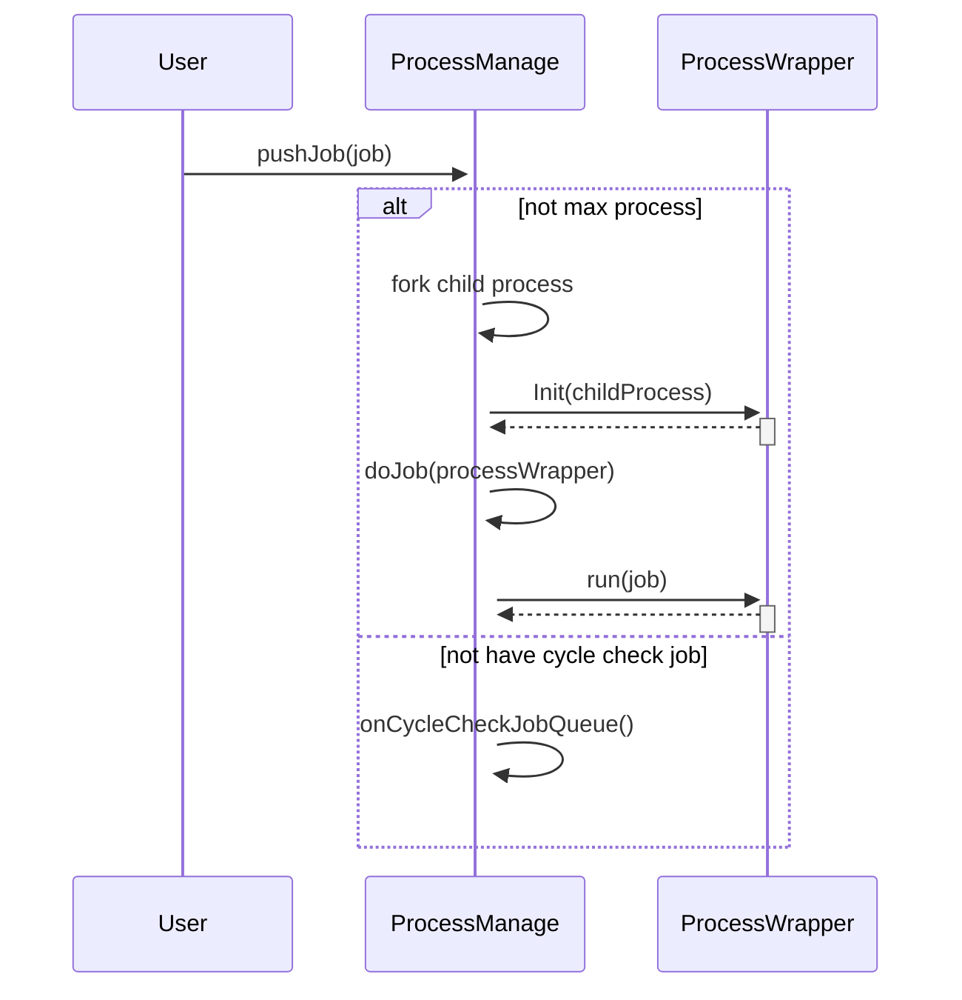

## Sequence Diagram

[mermaid link](https://knsv.github.io/mermaid/live_editor/#/view/c2VxdWVuY2VEaWFncmFtCiAgVXNlci0-PisgUHJvY2Vzc01hbmFnZTogcHVzaEpvYihqb2IpCiAgYWx0IG5vdCBtYXggcHJvY2VzcwogICAgUHJvY2Vzc01hbmFnZS0-PisgUHJvY2Vzc01hbmFnZTpmb3JrIGNoaWxkIHByb2Nlc3MKICAgIFByb2Nlc3NNYW5hZ2UtPj4rIFByb2Nlc3NXcmFwcGVyOiBJbml0KGNoaWxkUHJvY2VzcykKICAgIFByb2Nlc3NXcmFwcGVyLS0-Pi0gUHJvY2Vzc01hbmFnZTogCiAgICBQcm9jZXNzTWFuYWdlLT4-KyBQcm9jZXNzTWFuYWdlOiBkb0pvYihwcm9jZXNzV3JhcHBlcikKICAgIFByb2Nlc3NNYW5hZ2UtPj4rIFByb2Nlc3NXcmFwcGVyOiBydW4oam9iKQogICAgUHJvY2Vzc1dyYXBwZXItLT4-LSBQcm9jZXNzTWFuYWdlOiAKICBlbHNlIG5vdCBoYXZlIGN5Y2xlIGNoZWNrIGpvYgogICAgUHJvY2Vzc01hbmFnZS0-PisgUHJvY2Vzc01hbmFnZTogb25DeWNsZUNoZWNrSm9iUXVldWUoKQogIGVuZA)
